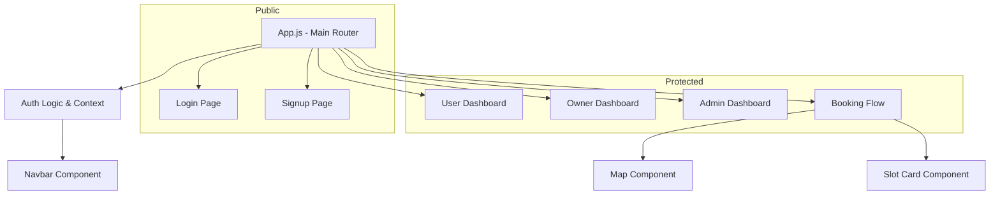

# ⚛️ Smart Parking Frontend


## 📖 Overview

The **Smart Parking Frontend** is a responsive, single-page application (SPA) built with React.js. It provides an intuitive interface for users to book parking slots, owners to manage their inventory, and admins to oversee the system.

---

## 🏗️ Frontend Architecture

The application is structured around a **Component-Based Architecture**, ensuring reusability and modularity.



---

## 📂 Project Structure

```bash
smart-parking-frontend/
├── public/                 # Static assets (images, favicon)
└── src/
    ├── components/         # Reusable UI widgets
    │   ├── Navbar.jsx      # Navigation bar
    │   ├── SlotCard.jsx    # Display individual slot info
    │   └── ...
    ├── pages/              # Full-page views (Routes)
    │   ├── LoginPage.jsx   # Authentication
    │   ├── Dashboard.jsx   # User central hub
    │   └── ...
    ├── services/           # API integration
    │   └── api.js          # Axial configuration & endpoints
    ├── styles/             # Global & component CSS
    └── App.js              # Main routing & state logic
```

---

## 🧩 Component Responsibilities

| Component / Page | Role/Responsibility | Access |
| :--- | :--- | :--- |
| **`App.js`** | Main entry point, handles Routing, Auth state check, and Auto-logout logic. | Global |
| **`Navbar.jsx`** | Navigation links based on user role (Owner/User/Admin). Handles Logout. | Global |
| **`LoginPage.jsx`** | User authentication form. Stores JWT in `localStorage`. | Public |
| **`Dashboard.jsx`** | User's home screen. Shows quick actions and recent activity. | User |
| **`SlotsPage.jsx`** | Lists all available parking slots with search and filter options. | User |
| **`ParkingMap.jsx`** | Leaflet map integration showing slots geographically. | User |
| **`BookingForm.jsx`** | Form to select time/date for booking a slot. | User |
| **`OwnerDashboard.jsx`** | Owner's control panel to add/edit/delete parking slots. | Owner |
| **`AdminDashboard.jsx`** | System-wide statistics and user management. | Admin |

---

## 📡 API Integration & State

### 1. Centralized API Service (`src/services/api.js`)
We use **Axios** with interceptors to automatically attach the JWT token to every request.

```javascript
/* src/services/api.js */
API.interceptors.request.use(config => {
    const token = localStorage.getItem("token");
    if (token) config.headers.Authorization = `Bearer ${token}`; // Auto-Auth
    return config;
});
```

### 2. State Management
*   **Local State**: `useState` is used for form inputs and toggles.
*   **Routing State**: `useNavigate` and `useLocation` pass data between pages.
*   **Global Auth**: `App.js` holds the `isAuthenticated` state and passes it down via props/context.

---

## 🚀 Setup & Run (Frontend Only)

### Prerequisites
*   **Node.js**: v18.0.0 or higher
*   **NPM**: Installed with Node

### Steps
1.  **Install Dependencies**:
    ```bash
    npm install
    ```
2.  **Environment Variables**:
    Create a `.env` file in the root if needed (optional for local dev usually, but good practice):
    ```env
    REACT_APP_API_URL=http://localhost:8080
    ```
3.  **Start Dev Server**:
    ```bash
    npm start
    ```
    The app runs at `http://localhost:3000`.

---

## 🔧 Troubleshooting

| Issue | Solution |
| :--- | :--- |
| **`'react-scripts' not found`** | Run `npm install` again to restore `node_modules`. |
| **API Calls Fail (401)** | Token expired. Logout manually or clear Application -> Local Storage in DevTools. |
| **Map Markers Missing** | Leaflet CSS might be missing. Check `index.js` imports. |
| **White Screen on Load** | Check Console (F12) for JavaScript errors. |

---

### 🎨 Styling
The project uses **Custom CSS** modules and standard CSS files located in `src/styles`. No external heavy frameworks (like Bootstrap) are strictly enforced, ensuring a lightweight and custom look.
